# FUTURE_MAP — where scarcity / value migrates next

> **What this is.** A living graph of falsifiable forward structural calls: pre-consensus bets on which inelastic constraint captures the rent before the market prices it. Generated wide, graduated strict. Forecasts are immutable — supersede, never edit; score Brier at resolution.

**Generated:** 2026-06-13 · **Method:** 12 orthogonal signal-channel miners (opus) → pre-consensus + supply-elasticity gate (sonnet) → adversarial refute pass (sonnet) → cross-channel synthesis (opus). 72 agents, ~2.3M tokens.

**Funnel:** 12 channels → 135 candidates gated → **47 PROMOTE** → adversarial refute → **18 survived as high-conviction** · **117 in wide candidate pool** (29 demoted by refute as already-priced).

**How to read a call:** every call names the *binding constraint* (the inelastic input), a *dated leading metric* to track it, *why it's still pre-consensus*, a *kill-criterion* that falsifies it, a *resolution date*, and a calibrated *P + interval*. The refute pass tried to prove each high-conviction call was already priced; survivors are where it failed.

---

## Synthesis — the cross-cutting read

The single loudest cross-cutting shift is that the AI buildout's binding constraint has already migrated past compute and even past the headline inputs (HBM, transformers, GPUs) into a deep stack of physically inelastic upstream nodes that almost nobody is pricing as a chain: HBM scarcity flows up into TSMC logic base-die wafers (compute-frontier-25/28), into hybrid-bonders and ABF/glass substrates (compute-frontier-30, constraint-migration-132), and into InP laser epitaxy (compute-frontier-29/34) and TFLN modulators (patent-concentration-69). On the power side the constraint visibly walks from transformer assembly to grain-oriented electrical steel (energy-power-42, constraint-migration-124) to MV switchgear/vacuum interrupters (energy-power-53, constraint-migration-129) to behind-the-meter gas and then to firm pipeline takeaway (energy-power-49, constraint-migration-126) and superalloy hot-section castings (constraint-migration-125) — a textbook constraint-migration cascade where rent keeps jumping one layer upstream. A second spine is China-concentrated midstream chokepoints being weaponized below the level of headline metals: samarium/SmCo (critical-materials-35), heavy-REE finishing (critical-materials-40, policy-export-control-83), coated spherical graphite (critical-materials-39, policy-export-control-86), and germane/GeF4 precursor gases (policy-export-control-81) — the granular sub-nodes nobody stockpiled. Third, a genuinely pre-consensus methods migration is underway in research: MLIPs crossing into industrial catalysis (arxiv-subtopic-2, cross-field-diffusion-12), flow-matching displacing diffusion across bio AND materials (arxiv-subtopic-7, cross-field-diffusion-17), and test-time compute reframing scientific design (arxiv-subtopic-6, cross-field-diffusion-21) — each shifting value from compute/models to scarce verifier/reference/assay data. Fourth, biotech's bottleneck is migrating off the headline modality (editor enzyme, antibody, cell factory) onto delivery and shared upstream (extrahepatic delivery in biotech-health-55/60 and patent-concentration-73; GMP plasmid/synthetic DNA in biotech-health-62; small-molecule chiral API in biotech-health-58) with AAV capacity actually inverting to overhang (biotech-health-61). The robotics/humanoid spine concentrates rent in the smallest, least-glamorous mechanical sub-components — strain-wave reducers, encoders, tactile skin (robotics-manufacturing-93/89/92) — rather than the robot. The strongest edge sits where these spines reinforce each other: He-3/dilution fridges gating quantum (critical-materials-38, constraint-migration-127, policy-export-control-85), iridium gating PEM hydrogen with AEM as the escape (constraint-migration-133, patent-concentration-66), and the same InP/SiC/heavy-REE upstreams feeding defense, EV and AI simultaneously.

## Top pre-consensus calls

| # | Call | P | Resolves | Binding constraint |
|---|------|---|----------|--------------------|
| 1 🟢 | The binding constraint on HBM4E/custom-HBM ramp shifts off DRAM cell yield onto leading-edge LOGIC foundry capacity for the base die: by H2  | 55% | 2027-12-31 | Leading-edge logic foundry wafer capacity (N5/N3) consumed by the HBM base die,  |
| 2 🟡 | By 2027-09-30, the spot price of high-purity samarium oxide (>99.9%, used for SmCo high-temperature magnets in defense actuators and aerospa | 28% | 2027-09-30 | Heavy/medium rare-earth (samarium) solvent-extraction separation capacity — ~100 |
| 3 🟢 | Once transformer assembly capacity is funded (Hitachi/Siemens 2028 plants), the binding constraint moves upstream to grain-oriented electric | 52% | 2027-12-31 | grain-oriented electrical steel (CRGO/GOES) laminations -- single US producer (C |
| 4 🟢 | Universal machine-learning interatomic potentials (MLIP foundation models like UMA/MatterSim) cross from materials screening INTO mainstream | 38% | 2027-12-31 | validated, transferable MLIP force-field accuracy near transition-metal surfaces |
| 5 🟢 | The binding constraint for in-vivo gene editing (base/prime editing, e.g. Verve, Beam, Prime Medicine in-vivo programs) becomes liver-extrah | 35% | 2028-12-31 | Extrahepatic in-vivo delivery (targeted LNP, AAV-alternative capsids, conjugate- |
| 6 🟡 | The next inelastic input in AI optical interconnect is NOT the silicon-photonics PIC but the external CW laser light source (InP DFB/comb):  | 50% | 2027-12-31 | Indium-phosphide CW laser die capacity + high-reliability laser-to-PIC attach (e |
| 7 🟡 | On-site behind-the-meter gas generation (reciprocating engines + aeroderivative/small gas turbines) becomes the de-facto bridge power for AI | 72% | 2027-12-31 | near-term dispatchable on-site generation; large frame gas turbines are sold out |
| 8 🟡 | By 2029-12-31, helium-3 (He-3) spot/contract price sustains >$3,000/L (vs ~$1,500-2,500 range) driven by quantum-computing dilution-refriger | 42% | 2029-12-31 | He-3 supply is a byproduct of tritium radioactive decay in weapons stockpiles —  |
| 9 🟡 | AAV manufacturing capacity transitions from bottleneck to OVERHANG: as dosing shifts toward lower-dose/redosable and non-AAV modalities, at  | 38% | 2027-12-31 | Large-scale AAV suspension bioreactor + plasmid/transfection capacity that was b |
| 10 🟡 | Test-time / inference-time compute scaling becomes the dominant published frontier-reasoning paradigm: arXiv share of papers explicitly on ' | 62% | 2026-12-31 | Verifier quality and reward-model/data for process supervision is the inelastic  |
| 11 🟡 | Harmonic/strain-wave reducer supply becomes the binding constraint on humanoid robot ramp: by H2 2027, lead times for high-precision (<1 arc | 38% | 2027-12-31 | high-precision small-frame strain-wave (harmonic) reducers; the inelastic input  |
| 12 🟡 | As behind-the-meter on-site gas generation (~100GW announced) bypasses the grid-interconnection bottleneck, the constraint migrates from gri | 42% | 2027-12-31 | firm interstate pipeline transport capacity and last-mile lateral interconnects  |

🟢 high-conviction (survived refute) · 🟡 top-ranked but in wide pool

---

## Dependency graph

Edges drawn across channels by the synthesis layer (high-conviction + top-ranked nodes). `-->` enables · `-.->` depends_on · `==>` amplifies · `~~~` competes.

```mermaid
graph LR
  n_arxiv_subtopic_2(["Machine-learning interatomic potentials (MLIP …"])
  n_arxiv_subtopic_3(["Continuous/test-time learning and memory archi…"])
  n_arxiv_subtopic_6["Test-time / inference-time compute scaling bec…"]
  n_biotech_health_55(["The binding constraint for in-vivo gene editin…"])
  n_biotech_health_61["AAV manufacturing capacity transitions from bo…"]
  n_climate_water_agri_101(["A US groundwater basin enters formal adjudicat…"])
  n_climate_water_agri_102(["Phosphogypsum / phosphate-processing waste sta…"])
  n_climate_water_agri_103(["Brackish/seawater desalination concentrate (br…"])
  n_compute_frontier_25(["The binding constraint on HBM4E/custom-HBM ram…"])
  n_compute_frontier_29["The next inelastic input in AI optical interco…"]
  n_constraint_migration_124(["Once transformer assembly capacity is funded (…"])
  n_constraint_migration_126["As behind-the-meter on-site gas generation (~1…"]
  n_critical_materials_35["By 2027-09-30, the spot price of high-purity s…"]
  n_critical_materials_38["By 2029-12-31, helium-3 (He-3) spot/contract p…"]
  n_cross_field_diffusion_12(["Universal machine-learning interatomic potenti…"])
  n_cross_field_diffusion_13(["Deep reinforcement learning for real-time magn…"])
  n_cross_field_diffusion_14(["Neural operators (Fourier/transformer PDE solv…"])
  n_cross_field_diffusion_15(["Differentiable programming / autodiff (born in…"])
  n_cross_field_diffusion_16(["Conformal prediction (distribution-free uncert…"])
  n_defense_space_dualuse_112(["Radiation-hardened space-grade FPGAs/SoCs beco…"])
  n_defense_space_dualuse_113(["Tactical-grade fiber-optic gyro (FOG) and MEMS…"])
  n_defense_space_dualuse_117(["Trusted/secure microelectronics packaging and …"])
  n_energy_power_49["On-site behind-the-meter gas generation (recip…"]
  n_robotics_manufacturing_90(["Auto-commissioning / sim-to-real deployment so…"])
  n_robotics_manufacturing_91(["A non-China LFP-cell or cathode equipment+proc…"])
  n_robotics_manufacturing_93["Harmonic/strain-wave reducer supply becomes th…"]
  n_energy_power_49 --> n_constraint_migration_126
  n_critical_materials_35 ==> n_defense_space_dualuse_113
  n_defense_space_dualuse_112 ==> n_defense_space_dualuse_117
  n_arxiv_subtopic_2 --> n_cross_field_diffusion_12
  n_cross_field_diffusion_12 -.-> n_arxiv_subtopic_2
  n_cross_field_diffusion_14 --> n_cross_field_diffusion_15
  n_arxiv_subtopic_6 ~~~ n_arxiv_subtopic_3
  n_biotech_health_55 ==> n_biotech_health_61
  n_robotics_manufacturing_90 -.-> n_robotics_manufacturing_93
```

*26 nodes, 9 intra-graph edges (of 149 total across all 135 calls). Rounded nodes = high-conviction survivors.*

---

## High-conviction tier — 18 calls that survived the refute pass

### AI-compute upstream constraint cascade (HBM -> logic base-die -> bonders/substrates -> photonics/lasers)

#### `compute-frontier-25` · The binding constraint on HBM4E/custom-HBM ramp shifts off DRAM cell yield onto leading-edge LOGIC foundry capacity for the base die: by H2 2027 the HBM base-die (TSMC N5/N3-class) becomes the gating wafer input, with custom-HBM logic-die NRE/wafer allocation, not stacking yield, determining who can ship premium HBM to NVIDIA/Google.

- **P = 55%** · **Resolves:** 2027-12-31 · **domain:** ai-compute · **supply:** inelastic
- **Binding constraint:** Leading-edge logic foundry wafer capacity (N5/N3) consumed by the HBM base die, plus the design-IP/NRE to tape it out
- **Leading metric:** Share of TSMC advanced-node (<=5nm) wafer starts allocated to HBM base dies vs SoC logic; today effectively ~0 in volume (HBM4 base die still 12nm-class), call resolves if >5% by H2 2027  _(now: HBM4 base die on ~12nm; HBM4E premium designs only just moving to N3/4nm; <1% of leading-edge wafers)_
- **Why pre-consensus:** Consensus frames the HBM crunch as memory-fab/stacking yield. The faint move is that the base die migrating to N3 makes HBM a *logic-foundry* consumer competing with GPUs for the same scarce wafers — a second-order claim on N3 capacity nobody is pricing as an HBM story.
- **Kill-criterion:** If through 2027 HBM base dies remain on >=10nm mature nodes (e.g. 12nm/4nm specialty) and consume no meaningful TSMC <=5nm capacity, the call is dead.
- **Refute check (survived):** The performance/architectural angle is priced (N3P base die = better HBM is public). The STRUCTURAL CONSTRAINT angle -- that N3 logic wafer allocation for HBM base dies competes with Rubin GPU wafers and becomes the binding gating variable on premium HBM supply in H2 2027, with NRE/wafer allocation rather than stacking yield as the true constraint -- is genuinely pre-consensus in equity markets and sell-side modeling. The call survives the adversarial gate on the constraint-migration framing, bu
- **Depends on:** custom-HBM buyer-specific logic dies, HBM4E ramp 2027, TSMC N3 capacity tightness
- **Enables:** HBM pricing power shifts to whoever controls foundry allocation, vertical integration of memory makers into logic foundry relationships

### Datacenter power & grid balance-of-plant migration (steel -> switchgear -> gas -> pipeline -> nuclear)

#### `constraint-migration-124` · Once transformer assembly capacity is funded (Hitachi/Siemens 2028 plants), the binding constraint moves upstream to grain-oriented electrical steel (GOES) core laminations. By H2 2027, GOES allocation -- not transformer fab slots -- becomes the explicitly cited gating item in US data-center power procurement, and CRGO spot premiums (M3/M4 grade) rise >25% above 2025 levels.

- **P = 52%** · **Resolves:** 2027-12-31 · **domain:** energy · **supply:** inelastic
- **Binding constraint:** grain-oriented electrical steel (CRGO/GOES) laminations -- single US producer (Cleveland-Cliffs Butler/Zanesville), multi-year qualification for new lines
- **Leading metric:** CRGO M-grade spot/contract price premium and reported GOES allocation lead time vs transformer assembly lead time  _(now: transformer lead times ~128-160 wks dominate the narrative; GOES named only as a contributing raw-material factor, Cliffs sole US producer)_
- **Why pre-consensus:** The consensus is fixated on the transformer/turbine as the bottleneck and on adding assembly capacity. Almost nobody is pricing that the new assembly plants will be starved of core steel -- GOES capacity is far slower to add (new CRGO lines take ~3-5yr and there is one domestic producer), so the rent migrates to the steel, not the winding.
- **Kill-criterion:** A second US/allied GOES line (e.g. JFE/Nippon/POSCO/new Cliffs line) reaches qualified data-center-grade output before end-2027, OR amorphous-core/3D-wound-core transformers scale enough that CRGO premiums stay flat (<10% above 2025).
- **Refute check (survived):** Survives as a genuinely pre-consensus SECOND-ORDER call. The first-order (GOES is tight) is priced; the specific migration timing (assembly capacity gets funded, GOES becomes the independently named procurement gate by H2 2027, M3/M4 spot +25% above 2025) is not yet in any mainstream report. However, the thesis is materially weaker than claimed: narrative saturation on GOES-as-constraint is already high, CLF has already rerated, and the known Cliffs expansion supply creates a live kill-criterion
- **Depends on:** transformer assembly capacity gets funded, AI data-center load growth continues
- **Enables:** electrical-steel capex cycle, amorphous-core transformer adoption

### Research methods migration: foundation models & cross-field technique diffusion

#### `arxiv-subtopic-2` · Machine-learning interatomic potentials (MLIP universal foundation models: MACE/CHGNet/Orb/equivariant-GNN class) cross into industrial materials/catalysis R&D as a standard screening tier: by end-2027 at least 3 chemical/materials/battery firms publicly report MLIP-driven screening in pipelines or peer-reviewed work, and universal-MLIP arXiv share keeps rising.

- **P = 52%**  (CI 32%–72%) · **Resolves:** 2027-12-31 · **domain:** materials · **supply:** inelastic
- **Binding constraint:** High-quality DFT/quantum reference datasets at scale and equivariant-GNN training talent; reference-data generation compute is the inelastic bottleneck, not inference.
- **Leading metric:** arXiv share 'machine learning interatomic potential\|MACE\|equivariant GNN\|universal force field' + count of industrial firms publicly using MLIP screening  _(now: Universal MLIPs (MACE-MP, etc.) are 2023-2025 arXiv breakouts; industrial adoption nascent, ~0-2 firms publicly disclosed as of mid-2026)_
- **Why pre-consensus:** Materials-AI is narrated through GNoME-style discovery headlines; the granular, durable shift is MLIPs becoming a routine simulation tier (replacing classical force fields), repricing DFT-reference-data generation as the scarce asset.
- **Kill-criterion:** By 2027-12-31 fewer than 3 industrial firms publicly report MLIP-based screening and universal-MLIP arXiv share has plateaued.
- **Refute check (survived):** The claim survives as pre-consensus on its specific, granular layer: (1) the framing of MLIPs as a ROUTINE SIMULATION TIER displacing classical force fields (vs. the dominant "AI discovers new materials" narrative) is not mainstream; (2) the binding-constraint identification -- DFT-reference-data compute as the repriced inelastic input, not inference -- appears in zero investor or analyst coverage; (3) the 3-firm public disclosure bar by end-2027 is achievable but not yet met (Matlantis industri
- **Depends on:** transferability of universal MLIPs across chemistries, reference-dataset scale
- **Enables:** faster catalyst/electrolyte discovery, DFT-data marketplaces

#### `cross-field-diffusion-13` · Deep reinforcement learning for real-time magnetic plasma control crosses from research tokamaks (TCV/KSTAR demos) INTO a privately-funded fusion startup's pilot/demonstration device control stack: at least one private fusion company (CFS, TAE, Tokamak Energy, Type One, Zap) publicly confirms an RL/learned controller in its real-time plasma-control loop on hardware, not just simulation.

- **P = 48%**  (CI 32%–62%) · **Resolves:** 2027-12-31 · **domain:** energy · **supply:** inelastic
- **Binding constraint:** real-time-certifiable learned controllers with bounded failure modes on bespoke hardware (the inelastic input is verified, disruption-safe learned control policies, not the RL algorithm itself)
- **Leading metric:** count of private-fusion-company-authored papers/press on hardware-deployed learned plasma controllers, currently near zero (DRL control still dominated by public labs/DeepMind-EPFL line)  _(now: ~0 private-company hardware-deployed RL plasma controllers publicly confirmed (2026-06))_
- **Why pre-consensus:** The DRL-tokamak story is read as a DeepMind/public-lab academic result; the market has not priced its migration into the capital-intensive private fusion race where control bottlenecks (disruptions, shape) gate net-energy timelines. The crossing from public-sim demos to private-hardware deployment is the early tell.
- **Kill-criterion:** By resolution date no private fusion company has publicly confirmed a learned/RL controller running on real plasma hardware, OR a public statement that classical (MPC/virtual-circuit) control remains preferred for safety certification.
- **Refute check (survived):** The claim survives as genuinely pre-confirmed, but the bar is narrow. The thesis is anticipated and widely discussed as imminent (not a surprise), so the alpha window is short: SPARC first plasma late 2026 or early 2027 is the likely trigger. The inelastic input (disruption-safe, real-time-certifiable learned controllers on bespoke private hardware) remains unconfirmed on any private device. Kill condition is clear: when CFS, Tokamak Energy, or another named private company publicly states an RL
- **Depends on:** disruption-safe RL control verification, private fusion devices reaching plasma-shot operations
- **Enables:** shorter net-energy demonstration timelines, learned-controller IP as a fusion differentiator

#### `cross-field-diffusion-12` · Universal machine-learning interatomic potentials (MLIP foundation models like UMA/MatterSim) cross from materials screening INTO mainstream wet-lab heterogeneous-catalyst discovery: at least one major industrial catalyst/chemicals producer (BASF, Johnson Matthey, Sabic, Dow) publicly attributes a new commercial catalyst formulation or process-condition change to MLIP-driven screening rather than DFT or empirical Edisonian search.

- **P = 38%**  (CI 24%–54%) · **Resolves:** 2027-12-31 · **domain:** materials · **supply:** inelastic
- **Binding constraint:** validated, transferable MLIP force-field accuracy near transition-metal surfaces and reaction barriers (the inelastic input is reactive-surface training data + uncertainty quantification, not compute)
- **Leading metric:** count of arXiv/ChemRxiv papers co-authored by industrial catalyst firms applying universal MLIPs to surface reaction energetics, currently ~single digits/quarter as of 2026-06  _(now: ~3-6 industry-coauthored universal-MLIP catalysis papers per quarter)_
- **Why pre-consensus:** Consensus treats MLIPs as a battery/crystalline-solids story (GNoME framing). Catalysis is harder (reactive surfaces, charge transfer) so it is under-claimed; the diffusion from bulk-crystal energetics into surface reaction barriers is the faint, granular crossing that is not yet priced into specialty-chemicals R&D narratives.
- **Kill-criterion:** By resolution date no major catalyst/chemicals producer has publicly tied a commercial formulation or process change to universal-MLIP screening, OR published benchmarks show universal MLIPs remain >0.2 eV error on adsorption/barrier energies for industrially relevant transition-metal surfaces.
- **Refute check (survived):** The call survives the pre-consensus test at the specific commercial-attribution level. The theme is priced into academic/R&D narratives but the precise crossing -- a named industrial producer publicly crediting MLIP screening for a commercial catalyst -- is not yet in any public disclosure. The binding constraint (reactive-surface training data + uncertainty quantification near transition-metal surfaces) is confirmed unsolved by the frontier literature, which is exactly what the original call id
- **Depends on:** MLIP foundation-model accuracy on reactive surfaces, release of large surface/adsorption DFT training sets (OC20/OC22 successors)
- **Enables:** faster specialty-chemical process redesign, shift of catalyst IP value from empirical know-how to training-data ownership

#### `cross-field-diffusion-14` · Neural operators (Fourier/transformer PDE solvers, born in academic ML) cross INTO the commercial EDA/semiconductor TCAD and thermal/electromigration sign-off flow: a major EDA vendor (Synopsys, Cadence, Ansys/Synopsys) ships or publicly demos a neural-operator surrogate replacing a finite-element step in a chip thermal or stress sign-off product.

- **P = 38%**  (CI 24%–53%) · **Resolves:** 2027-12-31 · **domain:** ai-compute · **supply:** inelastic
- **Binding constraint:** operator surrogates accurate enough for sign-off-grade tolerances on 3D, non-laminar, geometry-varying fields (the scarce input is certified-accuracy 3D surrogates, current variants stall at 2D/moderate-Reynolds)
- **Leading metric:** EDA-vendor product announcements or patents citing neural-operator/FNO surrogates in TCAD/thermal flows; currently aerospace/automotive CFD is the active beachhead, semiconductor sign-off is not yet  _(now: ~0 shipped EDA neural-operator sign-off features (2026-06); CFD/automotive is where adoption is real)_
- **Why pre-consensus:** Neural-operator hype is concentrated in fluid dynamics / weather. The diffusion into chip thermal/EM sign-off, where 3D-IC and chiplet stacking make FE simulation a throughput bottleneck, is the unpriced adjacency; the citation crossover from CFD into semiconductor multiphysics is still faint.
- **Kill-criterion:** No major EDA vendor ships or demos a neural-operator surrogate in a thermal/stress/EM sign-off product by resolution, OR published accuracy remains outside sign-off tolerance (>5% field error) for 3D-IC geometries.
- **Refute check (survived):** The call survives. The market has priced AI-in-EDA broadly (Cadence/Synopsys narratives saturated), but the specific mechanism -- a neural operator (FNO/transformer PDE solver) replacing a finite-element step at sign-off grade in a commercial thermal or EM sign-off product -- is absent from any shipped or formally demoed product as of June 2026. The academic signal is real (DAC 2023/2025 papers, DeepOHeat-v1) but the commercial crossing has not happened. The binding constraint identified (certif
- **Depends on:** neural-operator scaling to 3D turbulent/multiphysics, 3D-IC/chiplet thermal sign-off becoming a throughput bottleneck
- **Enables:** faster 3D-IC design iteration, shift of EDA value toward learned-surrogate model libraries

#### `cross-field-diffusion-16` · Conformal prediction (distribution-free uncertainty, born in statistics/ML) crosses INTO autonomous-laboratory / self-driving-lab decision loops as the standard mechanism for deciding which experiments to run, with multiple self-driving-lab platforms reporting conformal-guided active experiment selection.

- **P = 38%**  (CI 24%–53%) · **Resolves:** 2027-12-31 · **domain:** materials · **supply:** inelastic
- **Binding constraint:** calibrated, assumption-light uncertainty to safely allocate scarce wet-lab/robotic experiment budget (the scarce input is trustworthy uncertainty under distribution shift, not the lab robotics)
- **Leading metric:** count of self-driving-lab / autonomous-experimentation papers using conformal prediction for experiment selection; emerging but not yet standard (2026-06)  _(now: ~handful of conformal-in-the-loop autonomous-lab papers)_
- **Why pre-consensus:** Self-driving labs default to Bayesian optimization / GP uncertainty; the import of conformal prediction (which gives finite-sample coverage guarantees under weaker assumptions) into the experiment-selection loop is a quiet methods crossover not yet priced into the autonomous-lab tooling story.
- **Kill-criterion:** By resolution, self-driving-lab experiment selection remains dominated by Bayesian-optimization/GP uncertainty with negligible conformal-prediction adoption, OR conformal methods are shown to underperform GP-BO on real autonomous-lab campaigns.
- **Refute check (survived):** The call survives as pre-consensus but the "multiple platforms reporting it as standard" framing in the original claim is too strong and should be corrected. The honest formulation: a quiet methods-level crossover is beginning (1-2 academic papers bridging CP into BO for lab settings), zero platform adoption confirmed, dominant stack firmly GP/BO. The binding-constraint framing (calibrated distribution-free UQ for experiment budget allocation under distribution shift) is sound and unpriced. Kill
- **Depends on:** conformal-prediction maturity under distribution shift, self-driving-lab platform proliferation
- **Enables:** sample-efficient materials/chemistry discovery, uncertainty-as-a-service tooling layer for autonomous science

#### `arxiv-subtopic-3` · Continuous/test-time learning and memory architectures (beyond static-weights + context window) become a fast-growing published frontier sub-topic: arXiv share of papers on 'continual/online weight adaptation, learned memory modules, test-time training' among frontier-affiliated authors at least doubles by end-2027 and at least one frontier lab ships a model with persistent learned memory beyond context.

- **P = 30%**  (CI 15%–50%) · **Resolves:** 2027-12-31 · **domain:** ai-compute · **supply:** inelastic
- **Binding constraint:** Stable online-update algorithms that avoid catastrophic forgetting at frontier scale; the scarce input is the training methodology + eval, not compute.
- **Leading metric:** arXiv share 'test-time training\|continual learning\|persistent memory\|online adaptation' among frontier-lab authors; count of shipped models with persistent learned memory  _(now: Early/faint as of mid-2026; sporadic test-time-training and memory papers, no shipped persistent-memory frontier model)_
- **Why pre-consensus:** Consensus assumes the static-pretrain + RAG stack is permanent; the granular bet that learned persistent memory re-enters the frontier is contrarian and early. This is a genuine pre-consensus needle.
- **Kill-criterion:** By 2027-12-31 continual/test-time-training/memory arXiv share has not doubled and no frontier lab ships persistent learned memory beyond context.
- **Refute check (survived):** Call splits across two legs. The arXiv growth leg is near-consensus among specialists (trending, named by Hassabis as key 2026-2028 direction) but no market instrument prices it. The frontier-lab-ships leg is the genuinely pre-consensus needle and falsifiable gate: as of June 2026, zero frontier labs have shipped persistent in-weight learned memory. Call survives as pre-consensus because the defining falsifiable leg is unpriced. Risk: if TTT-E2E or an OpenAI model in H2 2026 crosses the threshol
- **Depends on:** solving catastrophic forgetting at scale, diminishing returns to context-length scaling
- **Enables:** personalized persistent agents, reduced retraining cost, memory-as-moat

#### `cross-field-diffusion-15` · Differentiable programming / autodiff (born in deep learning) crosses INTO end-to-end optimization of physical fabrication processes: at least one semiconductor or advanced-manufacturing firm publicly reports a differentiable-simulation pipeline used to co-optimize a process recipe (lithography, deposition, or etch) with the device design.

- **P = 27%**  (CI 14%–42%) · **Resolves:** 2028-06-30 · **domain:** ai-compute · **supply:** inelastic
- **Binding constraint:** differentiable, calibrated process simulators matching fab reality across the full recipe (the scarce input is a fab-accurate differentiable process model, not the autodiff framework)
- **Leading metric:** count of fab/equipment-vendor (TSMC, ASML, AMAT, Lam) papers/patents on differentiable process simulation for recipe co-optimization; sparse as of 2026-06  _(now: ~very few public differentiable-process-optimization disclosures from fabs/equipment vendors)_
- **Why pre-consensus:** Differentiable simulation is established in graphics/robotics but its migration into semiconductor process co-optimization (where recipe space is huge and FE/TCAD is slow) is faint and capital-gated. The crossover from ML/robotics autodiff into fab recipe space is the unpriced adjacency.
- **Kill-criterion:** No fab/equipment vendor publicly reports a differentiable process-simulation pipeline for recipe co-optimization by resolution, OR they state non-differentiable Bayesian/DOE methods remain preferred.
- **Refute check (survived):** Distinguish the two sub-claims: (1) differentiable optimization for MASK/LITHOGRAPHY-OPTICS = already mainstream, zero edge; (2) differentiable simulation co-optimizing FULL PROCESS RECIPE (etch, deposition, lithography physics together) with device design at a real fab = not priced, not publicly disclosed, still capital-gated. The call survives only for sub-claim (2). The kill criterion should be narrowed to exclude ILT/OPC (already priced) and require a public fab-side or equipment-vendor disc
- **Depends on:** fab-accurate differentiable process simulators, neural-operator/surrogate maturity for process physics
- **Enables:** faster process-design-co-optimization, shift of fab value toward differentiable digital twins

### Biotech bottleneck migration: off modality, onto delivery / shared upstream / capacity inversion

#### `biotech-health-55` · The binding constraint for in-vivo gene editing (base/prime editing, e.g. Verve, Beam, Prime Medicine in-vivo programs) becomes liver-extrahepatic targeted delivery, NOT the editor enzyme: the first non-liver in-vivo editing program (CNS, muscle, lung, or HSC in-vivo) to show human proof-of-mechanism will do so via a novel delivery modality (not naked LNP) by resolution date.

- **P = 35%**  (CI 20%–52%) · **Resolves:** 2028-12-31 · **domain:** biotech · **supply:** inelastic
- **Binding constraint:** Extrahepatic in-vivo delivery (targeted LNP, AAV-alternative capsids, conjugate-targeted) — the inelastic input gating editing beyond the liver
- **Leading metric:** Count of in-vivo editing programs with human extrahepatic proof-of-mechanism data, by target tissue, from 2026  _(now: In-vivo editing human data is essentially all liver (Verve PCSK9, Intellia ATTR/HAE); extrahepatic remains preclinical)_
- **Why pre-consensus:** Field celebrates editor precision (prime/base); the granular truth is editors are abundant and delivery to anything but liver is the wall, so value migrates to extrahepatic delivery platforms before the market reprices delivery as the scarce layer
- **Kill-criterion:** No human extrahepatic in-vivo editing proof-of-mechanism by 2028-12-31, or first extrahepatic success uses conventional AAV (delivery not novel)
- **Refute check (survived):** Narrow survival. The directional framing ("delivery is the wall") is no longer faint -- it is repeated at ASGCT, in Editas SEC filings, and by multiple funded private companies. The remaining edge is specific and time-bounded: (1) the transition moment when public-market valuations reprice delivery platforms above editor portfolios has not happened, (2) the modality specificity (non-naked LNP, e.g. engineered capsid or conjugate-targeted) for the first extrahepatic human readout is granular and 
- **Depends on:** liver in-vivo editing clinical validation continues, novel delivery capsid/conjugate platforms mature
- **Enables:** extrahepatic delivery platform licensing value, CNS and muscle genetic medicine markets, AAV manufacturing demand displacement

### Robotics/humanoid: rent in the smallest mechanical sub-components & deployment software

#### `robotics-manufacturing-91` · A non-China LFP-cell or cathode equipment+process bottleneck binds US battery reshoring: by end-2027, the gating constraint for qualified domestic LFP cell output is not gigafactory floor space but the scarcity of process-qualified coating/calendering equipment lines AND the engineers who can tune them, with >3 announced US LFP lines slipping production timelines citing equipment/process-qualification, not demand.

- **P = 52%** · **Resolves:** 2027-12-31 · **domain:** advanced-manufacturing · **supply:** inelastic
- **Binding constraint:** process-qualified electrode coating/calendering equipment + tacit process-engineering know-how for LFP (concentrated in China/Korea)
- **Leading metric:** count of US LFP cell lines slipping production start citing equipment/process qualification; import data for coating/calendering equipment  _(now: Multiple US LFP projects announced; early signs of process-qualification delays; tacit know-how dependency on Chinese/Korean equipment as of 2026)_
- **Why pre-consensus:** Reshoring narrative assumes capital + factory = output. The faint truth is that LFP yield depends on tacit coating/calendering process tuning concentrated in China, and the equipment+know-how transfer is the real binding constraint — invisible until lines miss ramp.
- **Kill-criterion:** If by end-2027 fewer than 3 US LFP lines cite equipment/process-qualification delays and domestic LFP ramps on schedule, kill it.
- **Refute check (survived):** Partially priced at the macro level (China tech concentration, export controls, equipment dependency are all public), but the specific binding-constraint framing -- coating/calendering process qualification as the CITED cause of >3 US LFP line slips -- is not yet in any mainstream outlet or equity analyst report. The claim survives as a forward structural call, but the kill-criterion needs precision: the call resolves TRUE only if at least 3 announced US LFP production lines publicly cite equipm
- **Depends on:** US LFP reshoring policy/capex, China equipment-export posture
- **Enables:** premium on domestic battery-process engineering talent, equipment-supplier diversification

#### `robotics-manufacturing-90` · Auto-commissioning / sim-to-real deployment software captures the rent that integration labor scarcity creates: by mid-2028 at least 2 robot OEMs or large integrators standardize on a foundation-model-driven auto-programming layer (natural-language or demonstration-to-policy) that cuts cell commissioning time >40%, and this software layer is sold/priced separately as the value-bearing component.

- **P = 38%** · **Resolves:** 2028-06-30 · **domain:** robotics · **supply:** inelastic
- **Binding constraint:** the constraint is human programming hours per cell; the inelastic asset becoming valuable is generalizable robot-skill policies / commissioning automation IP
- **Leading metric:** OEM/integrator announcements of demonstration-to-policy or NL-programming deployment cutting commissioning >40%; revenue disclosed as separate software line  _(now: Sim-to-real and learned policies still mostly research/pilot; no OEM prices commissioning-automation as a standalone value layer at scale as of 2026)_
- **Why pre-consensus:** Everyone talks VLA models for the robot's autonomy; few price the boring-but-huge market of cutting the human commissioning hours that gate every deployment. The value migrates from the robot to the deployment-software layer, which is unpriced.
- **Kill-criterion:** If by mid-2028 no OEM/integrator has standardized auto-commissioning cutting setup >40% with a separate priced software layer, kill it.
- **Refute check (survived):** The call survives the adversarial check. The general direction is visible and getting crowded at the venture layer, which is a mild negative for the pre-consensus claim. But the precise rent-migration thesis -- that a separately-priced auto-commissioning software layer becomes the value-bearing component that OEMs/integrators explicitly monetize -- remains unpriced. ABB's bundling decision (free with subscription) is actually evidence AGAINST it being priced-in: they haven't yet figured out how 
- **Depends on:** integration-labor scarcity (sibling call), VLA/sim-to-real maturity
- **Enables:** faster reshoring throughput, robotics-software margin expansion

### Water/climate-adaptation: physically-capped inputs gate datacenters, ag, and shipping

#### `climate-water-agri-101` · A US groundwater basin enters formal adjudication or mandatory pumping curtailment that strands a material share of permitted agricultural irrigation, repricing senior water rights upward >30% in that basin's transfer market within 18 months.

- **P = 52%** · **Resolves:** 2027-12-31 · **domain:** water · **supply:** inelastic
- **Binding constraint:** Physically depleting aquifer storage (Ogallala segments, central Arizona, Great Basin) crossing the threshold where the state caps total withdrawal below current permitted use.
- **Leading metric:** State-level groundwater adjudication filings / mandatory curtailment orders; recorded water-right transfer prices ($/acre-foot) in affected basins.  _(now: Arizona AMA pumping limits tightening; localized curtailments emerging 2025-26; transfer prices rising but not stepped)_
- **Why pre-consensus:** Water-right repricing happens basin-by-basin in obscure state proceedings invisible to public markets; the inflection from 'permitted on paper' to 'physically curtailed' is the un-priced trigger.
- **Kill-criterion:** No new mandatory curtailment/adjudication in a major irrigation basin and transfer prices rise <30% through 2027.
- **Refute check (survived):** The physical preconditions are advancing (curtailments are live, adjudications are being affirmed) but the specific inflection the thesis names -- a basin crossing the threshold where total withdrawals are NEWLY capped below total permitted use, producing a measured >30% senior-right repricing in that basin's transfer market within 18 months -- has not occurred and is not priced. The gap between the triggering legal/physical event and the financial market recognition of that event is the remaini
- **Depends on:** arid-West drought persists
- **Enables:** water-rights as financialized asset class, ag-to-industrial water transfers

#### `climate-water-agri-102` · Phosphogypsum / phosphate-processing waste stack capacity (radioactive byproduct disposal) becomes the binding permitting constraint on expanding US/EU low-cadmium phosphate processing, not the rock itself.

- **P = 48%** · **Resolves:** 2027-12-31 · **domain:** agriculture · **supply:** inelastic
- **Binding constraint:** Permitted phosphogypsum stack disposal capacity (1 ton P2O5 yields ~5 tons phosphogypsum; stacks are radioactive, near-unpermittable).
- **Leading metric:** New phosphogypsum stack permits issued vs denied in US/EU; regulatory moves on phosphogypsum reuse.  _(now: Stack permitting near-frozen in US; reuse rules contested)_
- **Why pre-consensus:** Everyone debates rock reserves and cadmium; almost nobody models that scaling clean-phosphate processing is capped by where you put the radioactive gypsum waste -- the truly inelastic link.
- **Kill-criterion:** A major new phosphogypsum stack or broad reuse approval is granted, removing the disposal bottleneck, by end-2027.
- **Refute check (survived):** Claim survives. Environmental channel has noticed; financial channel has not priced the specific mechanism. The Feb 2027 EPA RCRA decision and pending Army Corps permit are concrete upcoming catalysts with no analyst coverage. The low-cadmium/phosphogypsum synthesis is the uncovered seam. Survives as pre-consensus in the investor/market sense, with the caveat that environmental-policy coverage is real and the thesis is not wholly obscure -- the edge is in the cross-domain synthesis and the finan
- **Depends on:** low-Cd phosphate premium tier, no phosphogypsum reuse breakthrough
- **Enables:** phosphorus recovery / struvite recycling demand

#### `climate-water-agri-103` · Brackish/seawater desalination concentrate (brine) disposal capacity -- not desal energy or membranes -- becomes the binding permitting constraint that gates new inland desalination capacity in the arid US Southwest.

- **P = 44%** · **Resolves:** 2028-06-30 · **domain:** water · **supply:** inelastic
- **Binding constraint:** Permitted brine concentrate disposal (deep-well injection / outfall) -- environmentally constrained and slow to permit, caps inland desal regardless of membrane/energy cost.
- **Leading metric:** Inland desal projects stalled citing brine disposal; deep-well injection permit issuance for concentrate.  _(now: Several inland desal proposals; brine disposal repeatedly flagged as the gating permit)_
- **Why pre-consensus:** Desal discourse fixates on energy cost and membrane tech; the inelastic link is what you do with the concentrated brine inland -- a permitting/geology bottleneck almost nobody prices.
- **Kill-criterion:** Inland desal scales in the Southwest with brine disposal granted routinely, or zero-liquid-discharge becomes cheap, by end-2027.
- **Refute check (survived):** Thesis survives. The faint, granular signal is real: water-sector engineers and regulators know brine is the bottleneck; the capital market has not resolved this into a priced constraint. The specific claim -- that PERMITTED DISPOSAL CAPACITY (not energy, not membranes) gates inland desal permitted capacity -- is absent from all financial framing found. The two 2025 UIC primacy shifts are live, low-visibility regulatory events that directly move the permitting timeline for the only scalable inla
- **Depends on:** arid-West water scarcity, no cheap ZLD breakthrough
- **Enables:** zero-liquid-discharge / mineral-recovery tech demand, coastal-only desal concentration

### Defense/space dual-use: specialty sub-component chokepoints behind every platform

#### `defense-space-dualuse-113` · Tactical-grade fiber-optic gyro (FOG) and MEMS IMU supply becomes the binding input for mass-produced one-way-attack drones and loitering munitions as GPS-denied navigation requirements push every munition toward inertial-grade sensors; allied-sourced tactical IMU unit pricing fails to fall on the cost curve the drone-attritability thesis assumes.

- **P = 58%**  (CI 40%–75%) · **Resolves:** 2027-12-31 · **domain:** defense · **supply:** inelastic
- **Binding constraint:** Tactical/navigation-grade IMUs (FOG and high-end MEMS) with ITAR-clean, non-Chinese supply — the precision inertial sensor, not the airframe or warhead.
- **Leading metric:** Per-unit price and lead time of tactical-grade (1-10 deg/hr bias) IMUs from Western suppliers (e.g., SBG, Inertial Labs, Honeywell, Safran) in volume defense procurement.  _(now: Tactical-grade IMUs ~$2k-15k/unit in 2026; attritable-drone thesis assumes <$1k navigation suites at scale)_
- **Why pre-consensus:** The drone-attritability narrative ('cheap mass') is loud; the quiet fact is that GPS-denial (jamming/spoofing now standard on the modern battlefield) forces inertial-grade nav into every munition, and tactical IMUs do not follow consumer-MEMS cost curves because of calibration, test, and rad/temp qualification. The constraint moved from airframe cost to nav-sensor cost and pricing has not reflected it.
- **Kill-criterion:** A Western/allied tactical-grade IMU (≤10 deg/hr, GPS-denied capable) ships in volume below $1,000/unit by end-2027, or chip-scale atomic/photonic IMUs reach tactical grade at consumer price — the constraint dissolved.
- **Refute check (survived):** The call partially survives. Strip the broad framing (GPS-denied drives INS demand) -- that is priced. The surviving edge is the specific cost-curve failure argument: tactical/nav-grade qualification overhead creates a floor that consumer MEMS economics cannot undercut, and attritability procurement budgets have not modeled this gap. That claim is not in mainstream analyst coverage, not in the CSIS chokepoint framing, and not reflected in vendor pricing trends. The binding-constraint needle is: 
- **Depends on:** GPS jamming/spoofing remains pervasive, no chip-scale photonic IMU breakthrough at consumer price
- **Enables:** domestic MEMS-IMU fab investment, terrain/vision-aided nav as substitute, premium on ITAR-clean inertial suppliers

#### `defense-space-dualuse-112` · Radiation-hardened space-grade FPGAs/SoCs become the binding constraint on proliferated-LEO defense constellations: lead times for rad-hard reconfigurable logic (Microchip RTG4-class and successors) extend past 52 weeks and a US-allied rad-hard foundry capacity gap forces program reschedules in at least one SDA Tranche or comparable proliferated-constellation award.

- **P = 52%**  (CI 32%–72%) · **Resolves:** 2027-12-31 · **domain:** space · **supply:** inelastic
- **Binding constraint:** Rad-hard reconfigurable logic (rad-hard FPGA/SoC) fabrication capacity — a sub-100-wafer-class specialty node with one-to-two qualified Western fabs, not the satellites or launch.
- **Leading metric:** Quoted lead time for rad-hard space-grade FPGAs (e.g., Microchip RTG4/PolarFire-SpaceGrade class) from distributor/OEM channels; distinct from commercial FPGA lead times.  _(now: ~40-52 week quoted lead times as of mid-2026; commercial FPGA lead times already normalized post-2023, masking the rad-hard divergence)_
- **Why pre-consensus:** Consensus prices 'satellite mass production' and launch cadence (Starship, proliferated LEO) as the story. The faint signal is that proliferated constellations multiply per-bird rad-hard part counts while the rad-hard node base is fixed and uneconomic to expand; nobody is pricing the silicon-substrate bottleneck under the constellation theme.
- **Kill-criterion:** Rad-hard space FPGA lead times fall below 30 weeks and no SDA/proliferated-LEO program cites parts availability in a reschedule through 2027 — the bottleneck migrated elsewhere or COTS-upscreen displaced rad-hard.
- **Refute check (survived):** Partial pricing: the category-level signal is mainstream and shrinking fast. The claim survives only at its stated granularity -- the specific RTG4-class lead-time threshold and a named program reschedule attributed to that sub-tier specifically. That tripwire has not been pulled publicly. Recommend tightening the kill-criterion: survives if and only if an official SDA/DoD procurement filing or program-status report cites rad-hard FPGA lead times (not "hardened electronics" generically) as a sch
- **Depends on:** proliferated-LEO buildout continues, COTS-upscreen not qualified for the orbit/mission class
- **Enables:** domestic rad-hard foundry investment, shift to RISC-V rad-hard SoC designs, single-source pricing power for incumbent rad-hard suppliers

#### `defense-space-dualuse-117` · Trusted/secure microelectronics packaging and assembly (advanced packaging on a DMEA-accredited or domestic line) — not wafer fab — becomes the binding constraint for fielding leading-edge compute in defense autonomy/edge-AI systems; a defense edge-AI/autonomy program cites trusted advanced-packaging capacity as the limiter.

- **P = 48%**  (CI 28%–67%) · **Resolves:** 2028-06-30 · **domain:** defense · **supply:** inelastic
- **Binding constraint:** Domestic/trusted advanced packaging (2.5D/3D, chiplet integration) and assembly-test capacity for defense-grade AI accelerators — packaging, not the foundry, given CHIPS funds fab but underweights OSAT/packaging.
- **Leading metric:** Available trusted/domestic advanced-packaging capacity and lead times for defense AI accelerator integration; program statements naming packaging/ATP as limiter.  _(now: US has near-zero leading-edge advanced-packaging capacity domestically (concentrated in Taiwan/Korea); CHIPS packaging program nascent as of 2026)_
- **Why pre-consensus:** The CHIPS narrative and 'compute is the constraint' are consensus at the wafer-fab level. The under-priced needle is that even with domestic fabs, leading-edge packaging (where chiplets and HBM are integrated) is almost entirely offshore, and defense autonomy needs trusted packaging. The bottleneck for trusted edge-AI hardware is the back-end, not the front-end.
- **Kill-criterion:** Trusted/domestic advanced-packaging capacity scales (CHIPS packaging facilities online and qualified) such that no defense edge-AI program cites packaging as a limiter through 2028.
- **Refute check (survived):** The thesis survives as pre-consensus but only in its narrow, defense-specific form. The broad packaging-bottleneck narrative is entirely priced. The edge is the specific sub-claim: domestic DMEA-accredited leading-edge 2.5D/3D packaging (chiplet + HBM integration) capacity as the named program-gating constraint for a fielded defense autonomy/edge-AI system. That specific intersection has essentially zero analyst coverage in defense channels and no documented program-office citation. The call mus
- **Depends on:** defense edge-AI/autonomy programs need leading-edge compute, trusted-supply policy enforced
- **Enables:** domestic OSAT/packaging capex, chiplet-based defense compute architectures, trusted-supply premium for packaging firms

---

## Wide candidate pool — 117 calls (generate-wide; pricing risk flagged, not yet high-conviction)

*29 of these were demoted from PROMOTE by the refute pass (judged already-priced). Marked ⤵.*

### AI-compute upstream constraint cascade (HBM -> logic base-die -> bonders/substrates -> photonics/lasers)

| id | Call | P | Resolves | Binding constraint | Kill-criterion |
|----|------|---|----------|--------------------|----------------|
| `compute-frontier-28` ⤵ | Buyer-specific CUSTOM HBM (logic base die designed to a single customer's spec) restructures HBM from a commodity into a | 60% | 2028-12-31 | Custom HBM base-die design capability + IP + reserved leading-edge fou | If HBM through 2028 remains a standardized JEDEC commodity with no volume buyer-specific b |
| `compute-frontier-32` | DRAM cannibalization by HBM creates a binding shortage in CONVENTIONAL server/edge DRAM (DDR5/LPDDR) that throttles non- | 55% | 2027-12-31 | Standard DRAM wafer capacity diverted to HBM (HBM uses ~2x wafer area/ | If standard DRAM prices stabilize or fall through 2026-2027 (capacity additions outpace HB |
| `compute-frontier-26` ⤵ | Vertical power delivery (power-on-package / integrated voltage regulation silicon directly under or beside the GPU) beco | 52% | 2027-12-31 | Package-integrated power delivery silicon (lateral/vertical PoP regula | If 2027 flagship accelerators continue to meet power needs with conventional lateral board |
| `compute-frontier-29` | The next inelastic input in AI optical interconnect is NOT the silicon-photonics PIC but the external CW laser light sou | 50% | 2027-12-31 | Indium-phosphide CW laser die capacity + high-reliability laser-to-PIC | If CPO volume ramps through 2027 with laser supply and attach yield NOT cited as a gating  |
| `policy-export-control-82` | BIS will extend the AI-chip export rule from compute-performance thresholds (TPP/performance-density) to HIGH-BANDWIDTH- | 50% | 2027-06-30 | leading-edge HBM3E/HBM4 stacking + advanced packaging capacity (SK Hyn | No further BIS tightening of HBM thresholds or HBM-packaging-tool controls by resolution d |
| `policy-export-control-87` | The US will extend export-control / outbound-investment screening explicitly to ELECTRONIC-DESIGN-AUTOMATION (EDA) softw | 50% | 2027-03-31 | leading-edge EDA tool-flow (Synopsys/Cadence/Siemens), a 3-vendor olig | BIS fully rescinds China EDA controls with no node-class carve-out by resolution date, OR  |
| `compute-frontier-34` | InP / III-V epitaxy capacity (MOCVD reactor base) becomes a quietly binding constraint across AI photonics simultaneousl | 45% | 2028-12-31 | Indium-phosphide / III-V epitaxial wafer + MOCVD reactor capacity feed | If InP/III-V epi capacity expands ahead of demand or is never cited as a shared AI-optics  |
| `patent-concentration-69` ⤵ | A tight cluster of <5 commercial assignees will concentrate filings in CPC G02F1/01 / G02B6 covering THIN-FILM LITHIUM N | 45% | 2027-09-30 | wafer-scale TFLN modulator fabrication and integration IP — the inelas | TFLN-modulator commercial filings stay below 4 concentrated assignees, or co-packaged-opti |
| `compute-frontier-31` | Glass-core substrates (and panel-level / CoPoS) move from roadmap to a genuine capacity-relief vs scarce silicon interpo | 40% | 2028-06-30 | Glass-core substrate manufacturing yield + panel-level (square) packag | If through 2028 all flagship AI packages remain on silicon interposers / CoWoS-L organic R |
| `compute-frontier-30` | Hybrid-bonding (Cu-Cu direct bond) tooling and process control becomes the gating capex for >=16-high HBM at HBM4E: the  | 38% | 2027-12-31 | Die-to-wafer hybrid-bonding tool capacity (BESI/ASMPT-class) + ultra-t | If 16-hi HBM4E ships in volume on advanced microbump/TCB without hybrid bonding, or hybrid |
| `robotics-manufacturing-97` | Advanced-packaging (chiplet) assembly tooling becomes the AI-compute bottleneck moving DOWNSTREAM from CoWoS capacity to | 38% | 2027-12-31 | sub-micron-overlay hybrid die-bonders (Cu-Cu) for advanced packaging;  | If by end-2027 hybrid-bonder lead times are under 6 months and CoWoS remains the singular  |
| `constraint-migration-132` | Within the AI-compute stack, after HBM capacity is expanded, the binding constraint moves to advanced 2.5D/3D packaging  | 38% | 2027-12-31 | ABF build-up film and fine-line organic/glass substrate + interposer s | Through 2027 accelerator output stays gated by CoWoS tool capacity or HBM with substrate/i |
| `compute-frontier-27` ⤵ | Lam-style EUV DRY resist (vapor-phase metal-oxide deposition+development) crosses into a volume production layer at a le | 35% | 2028-12-31 | EUV dry-resist deposition/develop tool capacity (Lam single-source) an | If through 2028 all EUV/High-NA production layers remain on wet spin-coat resist with dry  |
| `patent-concentration-70` ⤵ | Filings in CPC H10N50 / G11C11/16 covering SPIN-ORBIT-TORQUE (SOT) MRAM (distinct from incumbent STT-MRAM) will concentr | 35% | 2028-03-31 | field-free SOT switching + materials-stack IP — the inelastic input is | SOT-MRAM families stay below 15% of top-assignee MRAM IP, or field-free-switching claims f |
| `policy-export-control-88` | A major economy will impose binding export controls or licensing on FRONTIER-AI MODEL WEIGHTS or training-cluster interc | 30% | 2027-06-30 | high-bandwidth scale-up/scale-out interconnect (NVLink switch, InfiniB | No BIS or allied rule names interconnect switch ASICs or frontier model-weights as a separ |
| `constraint-migration-128` | As model training compute and power get solved via distributed/multi-region buildout, the next binding constraint become | 28% | 2027-12-31 | coherent long-haul optical transport: 800G+ ZR/ZR+ coherent pluggables | Frontier training stays single-site (power solved per-site) through 2027, OR coherent long |
| `patent-concentration-78` | A tight cluster of <6 commercial assignees will concentrate filings in CPC C01B32/15 / B82Y covering BORON NITRIDE and o | 18% | 2028-06-30 | wafer-scale single-crystal hBN dielectric growth IP — the inelastic in | Wafer-scale hBN/2D-dielectric commercial filings stay below 4 concentrated assignees, or r |

### Datacenter power & grid balance-of-plant migration (steel -> switchgear -> gas -> pipeline -> nuclear)

| id | Call | P | Resolves | Binding constraint | Kill-criterion |
|----|------|---|----------|--------------------|----------------|
| `energy-power-44` ⤵ | SMR delivery for AI is gated not by NRC licensing but by nuclear-grade large forgings and the qualified n-stamp (ASME Se | 75% | 2028-12-31 | ASME Section III nuclear-grade large forgings and N-stamp qualified he | Any hyperscaler-contracted SMR delivers commercial grid power before 2029-01-01, OR forgin |
| `energy-power-49` | On-site behind-the-meter gas generation (reciprocating engines + aeroderivative/small gas turbines) becomes the de-facto | 72% | 2027-12-31 | near-term dispatchable on-site generation; large frame gas turbines ar | Behind-the-meter gas for datacenters stays below 5 GW cumulative by end-2027, OR frame-tur |
| `energy-power-45` ⤵ | HALEU (high-assay low-enriched uranium) fuel supply, not reactor hardware, becomes the explicitly-named binding constrai | 70% | 2027-12-31 | Western (non-Russian) HALEU enrichment capacity — Centrus Piketon is t | Western HALEU capacity demonstrably exceeds 3 t/yr before end-2027 (multiple cascades onli |
| `policy-export-control-80` ⤵ | The US DOE / NRC will issue a binding HALEU (high-assay low-enriched uranium) procurement or enrichment-capacity mandate | 70% | 2027-06-30 | domestic non-Russian HALEU enrichment capacity (Centrus is effectively | No DOE HALEU offtake/award advances a domestic enrichment line to commercial-scale FID by  |
| `energy-power-48` | Two-phase immersion cooling stalls as a dead-end for frontier AI racks because its PFAS dielectric fluid supply chain co | 65% | 2027-12-31 | fluorinated dielectric two-phase working fluid — 3M (dominant producer | A non-PFAS two-phase dielectric (or a re-entrant fluorinated supplier) reaches commercial  |
| `energy-power-42` ⤵ | Grain-oriented electrical steel (GOES), not transformer assembly capacity, is named as the residual binding input: U.S.  | 62% | 2027-12-31 | domestic grain-oriented electrical steel — one major U.S. producer (Cl | U.S. large-power-transformer lead times fall below 90 weeks before 2027-12-31, OR a second |
| `energy-power-50` | The 800VDC rack power transition makes the medium-voltage solid-state transformer / power-shelf the new value-capture la | 60% | 2027-12-31 | qualified medium-voltage 800VDC power-conversion hardware (solid-state | Through 2027 the industry stays on 415/480VAC + 48V/54V rack architecture for the bulk of  |
| `energy-power-52` | Copper, specifically high-conductivity copper for windings/busbars, tightens enough that aluminum substitution and coppe | 55% | 2027-12-31 | refined high-purity copper for electrical windings and busbars — mine- | No major hyperscaler/utility cites copper as a distribution-architecture or cost driver by |
| `energy-power-43` ⤵ | Grid-firming battery storage demand for datacenters concentrates rent in LFP cell + (specifically) the LFP cathode/separ | 52% | 2027-12-31 | non-China-sourced LFP cells and LFP cathode active material; China con | Domestic-content-compliant LFP cells reach price parity (within 10%) with landed Chinese c |
| `patent-concentration-77` | A small cluster of commercial assignees (Form Energy, ESS Inc, and 2-3 new entrants) will concentrate filings in CPC H01 | 45% | 2027-12-31 | iron-electrode cycle-life / passivation-control IP — the inelastic inp | Iron-air/iron-electrode commercial filings remain a single dominant assignee with no secon |
| `compute-frontier-33` | Direct-to-chip / two-phase liquid cooling and its supply chain (cold plates, quick-disconnects, CDUs, dielectric fluids) | 42% | 2027-12-31 | Liquid-cooling hardware supply (cold plates, leak-proof quick-disconne | If >1MW racks deploy through 2027 without cooling-component supply/qualification being a g |
| `constraint-migration-126` | As behind-the-meter on-site gas generation (~100GW announced) bypasses the grid-interconnection bottleneck, the constrai | 42% | 2027-12-31 | firm interstate pipeline transport capacity and last-mile lateral inte | By end-2027, >80% of announced behind-the-meter gas data centers proceed on schedule with  |
| `constraint-migration-125` ⤵ | Inside the gas-turbine bottleneck, the true inelastic node is the hot-section investment castings (single-crystal nickel | 42% | 2027-12-31 | single-crystal nickel-superalloy hot-section investment castings + dir | By end-2027 OEMs expand turbine output materially without citing or investing in hot-secti |
| `energy-power-47` | FERC's large-load interconnection final rule (RM26-4) institutionalizes curtailable/flexible-load fast-tracking, making  | 38% | 2027-12-31 | firm grid interconnection capacity; the binding scarcity flips from fi | FERC rule is vacated, indefinitely delayed past 2027, or finalized without a flexible/curt |
| `constraint-migration-129` | Within the data-center electrical bottleneck, the faint sub-node is medium-voltage switchgear and vacuum interrupters, f | 38% | 2027-12-31 | medium-voltage switchgear and vacuum-interrupter tube production (SF6- | MV switchgear lead times stay below ~50 weeks through 2027 and switchgear is never cited a |
| `energy-power-53` | Switchgear and circuit breakers (low/medium-voltage), not transformers, emerge as the surprise tightest electrical balan | 35% | 2027-12-31 | medium-voltage switchgear, circuit breakers and the molded-case/vacuum | MV switchgear lead times stay below 60 weeks through end-2027, OR transformers remain unam |
| `patent-concentration-72` | A small cluster of GaN-power-device makers (Navitas, Infineon, Innoscience, Power Integrations) will sharply concentrate | 35% | 2027-12-31 | vertical GaN epitaxy and edge-termination IP — the inelastic input is  | Vertical-structure GaN families remain below 15% of top-assignee GaN power filings, or fil |
| `constraint-migration-131` | As lithium and cathode supply for grid/EV batteries ease, the binding constraint for utility-scale storage migrates to g | 30% | 2028-06-30 | grid-forming inverter firmware/hardware + high-power SiC/IGBT modules  | Through 2028 BESS deployment remains gated by cell/lithium availability and grid-forming i |
| `energy-power-51` | Static VAR / dynamic reactive-power compensation (STATCOMs, synchronous condensers) becomes a named gating item for larg | 28% | 2027-12-31 | fast dynamic reactive-power compensation hardware (STATCOM/SVC, synchr | Through 2027, large-load interconnection agreements broadly do NOT require on-site dynamic |
| `energy-power-46` | Wolfspeed's 200mm SiC wafer ramp, not transformer steel or turbines, becomes the publicly-named gating constraint on AI- | 22% | 2027-12-31 | 200mm high-voltage (3.3kV-10kV) SiC MOSFET die output from the handful | Through 2027 no SST OEM or hyperscaler cites SiC device supply for a power-shelf slip, AND |

### China-concentrated critical-materials midstream chokepoints & export-control weaponization

| id | Call | P | Resolves | Binding constraint | Kill-criterion |
|----|------|---|----------|--------------------|----------------|
| `policy-export-control-84` | The US will place a Chinese legacy-node (mature, 28nm-and-above) foundry or its analog/power-IC ecosystem on a tariff or | 62% | 2027-03-31 | trusted (non-China) mature-node analog/power-discrete + microcontrolle | No USTR tariff/301 action specifically targeting Chinese mature-node chips by resolution d |
| `critical-materials-39` | By 2028-12-31, battery-grade spherical (coated) graphite anode material from non-China sources stays below 15% of global | 48% | 2028-12-31 | Spheronization and coating of natural graphite into anode-grade CSPG — | Non-China qualified anode-material supply exceeds 15% of global, or coated-spherical premi |
| `policy-export-control-79` ⤵ | The EU Critical Raw Materials Act will designate a binding domestic-PROCESSING (not just mining) benchmark enforcement t | 48% | 2027-06-30 | EU midstream refining/separation capacity (the 'processing 40% benchma | No EU strategic-project lithium-refining or RE-separation facility reaches FID/final permi |
| `policy-export-control-83` | China will impose export licensing on rare-earth permanent-magnet MANUFACTURING EQUIPMENT and sintered-NdFeB magnets at  | 42% | 2027-06-30 | heavy-rare-earth (Dy/Tb) high-coercivity sintered-magnet finishing + g | No MOFCOM licensing of finished NdFeB magnets or GBD/sintering equipment by resolution dat |
| `patent-concentration-75` | Filings in CPC C22B7 / C22B26 / H01M10/54 covering DIRECT-RECYCLING (cathode-to-cathode, not pyro/hydro) of lithium batt | 40% | 2027-12-31 | cathode crystal-structure-preserving relithiation process IP — the ine | Direct-recycling commercial filings stay below 4 concentrated assignees, or direct-recycle |
| `policy-export-control-86` | China will tighten or formalize export licensing on a specific BATTERY-PROCESSING input — most likely graphite anode mat | 40% | 2027-03-31 | coated spherical-graphite anode + LFP cathode-active-material processi | No further MOFCOM tightening of graphite-anode or LFP-tech export licensing by resolution  |
| `critical-materials-36` | By 2027-12-31, high-purity quartz (HPQ) suitable for semiconductor and solar crucible liners trades at a >30% premium to | 32% | 2027-12-31 | IOTA-grade high-purity quartz for fused-silica crucibles — effectively | HPQ/crucible pricing stays within 15% of 2025 and no allocation is disclosed through 2027- |
| `critical-materials-37` | By 2028-06-30, acid-grade fluorspar (acidspar, CaF2 >97%) sustains a >25% real price rise over 2025 AND a Western HF/flu | 30% | 2028-06-30 | Acid-grade fluorspar mining — the single upstream feedstock for hydrof | Acidspar real price stays within 15% of 2025 through 2028-06-30 and no Western fluorochemi |
| `critical-materials-35` | By 2027-09-30, the spot price of high-purity samarium oxide (>99.9%, used for SmCo high-temperature magnets in defense a | 28% | 2027-09-30 | Heavy/medium rare-earth (samarium) solvent-extraction separation capac | Samarium oxide price stays within +/-25% of mid-2026 level through 2027-09-30, or any non- |
| `critical-materials-41` | By 2028-12-31, scandium oxide demand from AlSc master-alloy (aerospace/additive-manufacturing) and solid-oxide-fuel-cell | 28% | 2028-12-31 | Scandium has no primary deposit; all supply is byproduct recovery (bau | Scandium oxide price rises less than 50% from 2025 through 2028-12-31, or qualified primar |
| `policy-export-control-81` | China will impose formal export licensing on gallium-germanium-grade high-purity germanium tetrafluoride / germane (the  | 28% | 2027-06-30 | electronic-grade germane/GeF4 precursor gas refining capacity (concent | By resolution date no MOFCOM decree adds germanium precursor gases/compounds to the licens |
| `critical-materials-40` | By 2028-12-31, dysprosium and terbium (heavy REE for high-temperature NdFeB magnet grades) trade at a widening ratio to  | 22% | 2028-12-31 | Heavy rare-earth (Dy/Tb) solvent-extraction separation — concentrated  | Dy:NdPr oxide ratio stays below 4x through 2028-12-31, or ex-China heavy-REE separation re |

### Research methods migration: foundation models & cross-field technique diffusion

| id | Call | P | Resolves | Binding constraint | Kill-criterion |
|----|------|---|----------|--------------------|----------------|
| `arxiv-subtopic-8` | Linear-attention / state-space hybrids (Mamba-style + attention) become the default published architecture for long-cont | 72% | 2026-12-31 | Kernel/hardware-aware implementation talent (custom CUDA/Triton scan k | By 2026-12-31 fewer than 2 production model families ship hybrid SSM-attention architectur |
| `cross-field-diffusion-18` | Mechanistic-interpretability techniques developed for LLMs (sparse autoencoders, dictionary learning of features) cross  | 72% | 2027-06-30 | interpretable, sparse decomposition of opaque biological foundation-mo | Fewer than 3 substantive bio-foundation-model interpretability papers using SAE/dictionary |
| `cross-field-diffusion-21` | Test-time compute / inference-time search (the o-series reasoning paradigm from LLMs) crosses INTO scientific generative | 65% | 2027-06-30 | cheap, reliable in-silico oracles to score generated candidates at inf | By resolution, protein/molecule design SOTA is still attributed primarily to model/data sc |
| `arxiv-subtopic-6` | Test-time / inference-time compute scaling becomes the dominant published frontier-reasoning paradigm: arXiv share of pa | 62% | 2026-12-31 | Verifier quality and reward-model/data for process supervision is the  | By 2026-12-31 pretraining-scaling/architecture papers still outnumber test-time-compute pa |
| `arxiv-subtopic-11` | Hardware-aware low-precision training (FP8/FP4 and microscaling formats) becomes the published default for frontier pret | 62% | 2026-12-31 | Numerically-stable low-precision training recipes (scaling, loss-scali | By 2026-12-31 most new frontier large-model training papers still report BF16/FP16 as prim |
| `cross-field-diffusion-17` | Flow matching (rectified/Riemannian variants, born in image generation and matured in protein backbone design) crosses I | 62% | 2027-06-30 | few-step, manifold-respecting generation that handles periodic lattice | At 2027 NeurIPS/ICLR, diffusion-objective crystal-generation papers still outnumber flow-m |
| `arxiv-subtopic-9` | Talent inflow inflection: net migration of senior ML researchers (>=5 years, prior cs.LG/NeurIPS publication history) in | 58% | 2026-12-31 | Real-world manipulation/interaction data (teleop, contact-rich demonst | By 2026-12-31 the cs.LG->cs.RO/q-bio first-time-author crossover rate is flat or down vs p |
| `arxiv-subtopic-5` ⤵ | AI-driven automated theorem proving / formal-math (Lean-based, with LLM + search) crosses from benchmark stunts into a u | 55% | 2027-12-31 | Formalized mathematical corpora (Lean mathlib-scale) and autoformaliza | By 2027-12-31 fewer than 2 elite groups publish peer-reviewed proofs/formalizations with m |
| `arxiv-subtopic-7` | Generative protein/biomolecular design shifts decisively from diffusion to flow-matching (and discrete-flow) backbones:  | 52% | 2026-12-31 | Experimentally validated structure-function training pairs and wet-lab | By 2026-12-31 denoising-diffusion remains the primary formulation in a majority of new eli |
| `cross-field-diffusion-23` | State-space / linear-attention sequence models (Mamba lineage, born to scale LLM context) cross INTO genomic foundation  | 52% | 2027-12-31 | linear-time long-range modeling over million-base contexts with retain | By resolution, new genomic foundation models predominantly use transformer-attention backb |
| `arxiv-subtopic-0` ⤵ | Neural surrogate 'operator learning' (FNO/DeepONet successors) crosses from ML demos into production engineering CAE/CFD | 52% | 2027-12-31 | Trusted high-fidelity simulation training data (paired PDE-solve datas | By 2027-12-31 fewer than 3 top-10 simulation/EDA vendors market a named learned-operator/s |
| `arxiv-subtopic-4` ⤵ | Diffusion/flow-based language models (discrete diffusion LMs) move from curiosity to a credibly competitive published tr | 42% | 2027-12-31 | Efficient parallel-decoding training recipes and the narrow talent tha | By 2027-12-31 no diffusion/flow-based LM from a serious lab comes within a small margin of |
| `arxiv-subtopic-1` ⤵ | Mechanistic interpretability stops being a niche-safety subfield and is adopted as a debugging/eval primitive by applied | 38% | 2027-12-31 | Scarce talent fluent in both circuits-level analysis and large-model e | By 2027-12-31 SAE/feature-circuit methods remain confined to safety/interp venues with <5  |
| `arxiv-subtopic-10` | Single-cell / spatial-omics foundation models become the fastest-growing methods sub-topic in computational biology: by  | 35% | 2027-12-31 | Harmonized, batch-corrected large-scale single-cell + spatial referenc | By 2027-12-31 cell foundation models are NOT used as a standard tier in a majority of new  |
| `cross-field-diffusion-24` | Reinforcement learning for chip floorplanning/placement (the AlphaChip lineage) crosses from Google-internal/research IN | 35% | 2027-12-31 | RL placement that beats human+classical-tool placement on real PPA at  | No major EDA vendor confirms an RL-based placement engine used on a customer production ta |
| `cross-field-diffusion-22` | Graph neural networks / link-prediction techniques from recommender systems and knowledge graphs cross INTO patent-citat | 30% | 2028-06-30 | high-recall, legally-defensible prior-art retrieval over heterogeneous | No patent office or major IP-analytics provider deploys a GNN/graph-structural prior-art o |
| `cross-field-diffusion-19` | Diffusion / generative models cross from molecules INTO inverse-design of metamaterials and photonic/acoustic structures | 28% | 2027-12-31 | generative inverse-design that respects manufacturable fabrication con | No company announces a commercially deployed metamaterial/metasurface attributed to a gene |
| `cross-field-diffusion-20` | Geometric deep learning / equivariant GNNs cross from molecular property prediction INTO routine pharmacokinetic / ADMET | 28% | 2028-06-30 | validated, audit-trail-grade equivariant models with regulatory-accept | No FDA/EMA filing or major-pharma disclosure cites a GNN/equivariant ADMET model as decisi |

### Biotech bottleneck migration: off modality, onto delivery / shared upstream / capacity inversion

| id | Call | P | Resolves | Binding constraint | Kill-criterion |
|----|------|---|----------|--------------------|----------------|
| `biotech-health-57` ⤵ | Bioconjugation/linker-payload chemistry capacity becomes the binding constraint on the antibody-drug conjugate (ADC) boo | 62% | 2027-12-31 | Highly potent API (HPAPI) handling + site-specific bioconjugation suit | No ADC sponsor/CDMO cites conjugation/HPAPI capacity as rate-limiting and no dedicated exp |
| `biotech-health-63` | Allogeneic/'off-the-shelf' cell therapy fails to relieve the autologous manufacturing bottleneck on schedule: through re | 58% | 2028-06-30 | Autologous cell-manufacturing slots + vein-to-vein logistics remain th | An allogeneic CAR achieves autologous-comparable durability in a pivotal readout and gains |
| `biotech-health-59` | Suzhou/Chinese peptide CDMOs (WuXi-class and domestic peers) capture a measurably rising share of global GLP-1/peptide A | 55% | 2027-12-31 | Protected amino acid + resin + crude peptide intermediate manufacturin | China peptide-intermediate export share to US/EU falls >20% year-over-year by end-2027 wit |
| `biotech-health-54` ⤵ | Amylin (and dual amylin/GLP-1, e.g. cagrilintide-class) becomes the next peptide-SPPS capacity crunch: amylin-analog pep | 52% | 2027-06-30 | SPPS peptide capacity reserved/qualified specifically for amylin analo | No CDMO or sponsor names amylin/cagrilintide-specific capacity by resolution date AND Cagr |
| `biotech-health-56` ⤵ | AI-designed de novo protein binders/biologics (RFdiffusion/AlphaProteo-class) cross from research into a clinical-stage  | 52% | 2028-06-30 | High-throughput wet-lab expression, binding, and developability valida | No de-novo-designed protein therapeutic enters Phase 1 by 2028-06-30, or all clinical 'AI  |
| `biotech-health-61` | AAV manufacturing capacity transitions from bottleneck to OVERHANG: as dosing shifts toward lower-dose/redosable and non | 38% | 2027-12-31 | Large-scale AAV suspension bioreactor + plasmid/transfection capacity  | AAV capacity remains tight/premium through 2027 with new sold-out expansions and no underu |
| `biotech-health-62` | Plasmid DNA (GMP, especially low-endotoxin and 'closed/synthetic' enzymatic DNA like doggybone/Touchlight-class) becomes | 38% | 2027-12-31 | GMP plasmid / enzymatic synthetic DNA capacity — the shared upstream i | No sponsor/CDMO cites plasmid or synthetic DNA as rate-limiting by 2027-12-31 and plasmid  |
| `patent-concentration-73` | CRISPR base/prime-editing DELIVERY filings will shift assignee concentration from viral (AAV) toward targeted LIPID NANO | 38% | 2028-03-31 | tissue-targeting (extra-hepatic) ionizable-lipid/LNP IP — the inelasti | Extra-hepatic targeted-LNP families stay below 20% of editing-delivery filings among top a |
| `biotech-health-64` | GLP-1 muscle-preservation co-therapy (myostatin/activin-pathway agents, e.g. bimagrumab/apitegromab-class + GLP-1 combos | 35% | 2028-06-30 | Large-scale mAb/Fc-fusion (CHO bioreactor) capacity dedicated to muscl | Muscle-preservation combos fail Phase 3 obesity endpoints or are not positioned as adjunct |
| `biotech-health-58` | The binding constraint on oral small-molecule GLP-1 agonists (orforglipron-class) shifting to NOT peptide-SPPS but high- | 32% | 2027-12-31 | Chiral/complex small-molecule API and key intermediate manufacturing c | First oral GLP-1 launches at full national scale with no rationing/allocation and manageme |
| `biotech-health-65` | Multiplex spatial/single-cell proteomics-genomics becomes the binding constraint on the next wave of target discovery an | 32% | 2028-06-30 | Proprietary spatial-omics consumables (probe panels, capture reagents, | No structural multi-year consumables/platform commitment by 2028-06-30 and spatial-omics r |
| `biotech-health-60` | In-vivo CAR-T (LNP- or vector-delivered CAR generated inside the patient, e.g. Capstan/AbbVie, Umoja-class) reaches a pi | 28% | 2028-06-30 | Cell-type-targeted delivery vehicles (anti-CD targeting ligands on LNP | No in-vivo CAR program reaches pivotal-intent trial by 2028-06-30 and lead programs stall  |
| `patent-concentration-76` | Filings in CPC A01H / C12N15/82 covering GENE-EDITED (CRISPR, not transgenic) NITROGEN-FIXATION traits in cereals and as | 28% | 2028-06-30 | oxygen-tolerant nitrogenase / associative-diazotroph colonization IP — | Engineered-N-fixation commercial filings stay below 4 concentrated assignees, or field-eff |

### Robotics/humanoid: rent in the smallest mechanical sub-components & deployment software

| id | Call | P | Resolves | Binding constraint | Kill-criterion |
|----|------|---|----------|--------------------|----------------|
| `robotics-manufacturing-95` | Rare-earth-free / reduced-dysprosium traction and joint motors cross from EV pilots into robotics joints faster than exp | 62% | 2027-12-31 | heavy rare earths (dysprosium, terbium) for high-temp NdFeB magnets in | If by end-2027 no humanoid/AMR program has publicly committed to reduced-heavy-rare-earth  |
| `robotics-manufacturing-89` ⤵ | Tactile/force-sensing skin becomes the gating constraint for dexterous manipulation, not vision: by mid-2028 >50% of new | 42% | 2028-06-30 | manufacturable, durable, high-spatial-resolution tactile skin that sur | If by mid-2028 fewer than 50% of new dexterous-hand programs integrate distributed tactile |
| `robotics-manufacturing-93` | Harmonic/strain-wave reducer supply becomes the binding constraint on humanoid robot ramp: by H2 2027, lead times for hi | 38% | 2027-12-31 | high-precision small-frame strain-wave (harmonic) reducers; the inelas | If by Q4 2027 HDSI lead times for sub-100mm precision reducers are under 16 weeks AND no n |
| `robotics-manufacturing-99` | Thermal management of joint-integrated actuators emerges as a limiting factor on humanoid duty cycle, and a phase-change | 38% | 2028-06-30 | heat dissipation from torque-dense joint motors during continuous oper | If by mid-2028 no humanoid program adds active joint cooling and duty-cycle remains a non- |
| `robotics-manufacturing-92` ⤵ | Absolute multi-turn encoders without batteries/gears (e.g., Wiegand-effect or inductive absolute) become the standardizi | 35% | 2027-12-31 | robust absolute encoders (inductive/Wiegand) surviving joint shock/vib | If by end-2027 inductive-absolute encoders hold under 40% of new humanoid joint designs an |
| `robotics-manufacturing-94` | Frameless torque motor + integrated dual-encoder modules (not the full actuator) become the margin-capturing layer in hu | 25% | 2027-12-31 | frameless torque-dense motors with co-located dual absolute encoders s | If by end-2027 the top 3 Western humanoid programs by deployed units all still design and  |
| `robotics-manufacturing-98` | Linear motors / precision linear actuators (not rotary joints) become the scarce input for the wave of automated 'dark'  | 25% | 2027-12-31 | high-precision linear motors / air-bearing motion stages for high-thro | If by end-2027 precision linear-motor lead times stay under 16 weeks and no reshoring line |
| `robotics-manufacturing-96` | Robot-grade cycloidal/RV reducer capacity outside Japan becomes a reshoring choke point for INDUSTRIAL (not humanoid) ro | 18% | 2027-12-31 | RV/cycloidal reducers for heavy industrial arm joints; Nabtesco contro | If by end-2027 no non-Japanese/non-Chinese RV-reducer producer achieves qualified-supplier |

### Water/climate-adaptation: physically-capped inputs gate datacenters, ag, and shipping

| id | Call | P | Resolves | Binding constraint | Kill-criterion |
|----|------|---|----------|--------------------|----------------|
| `climate-water-agri-100` ⤵ | Water-rights acquisition (not power or land) becomes the explicit gating line item that kills or delays at least 3 annou | 58% | 2027-12-31 | Senior consumptive water rights / aquifer recharge capacity in arid-We | Through 2027 no more than one additional project cites water-rights/permitting as the expl |
| `climate-water-agri-109` | Crop-insurance / reinsurance capacity for specific climate-correlated perils (compound drought-heat in concentrated brea | 40% | 2027-12-31 | Reinsurance balance-sheet appetite for spatially-correlated (non-diver | Crop reinsurance rate-on-line flattens/declines and multi-peril coverage availability stay |
| `climate-water-agri-105` | Panama Canal freshwater (Gatun Lake) -- not channel depth -- remains the binding throughput constraint such that draft r | 38% | 2027-09-30 | Freshwater inflow to Gatun Lake (each transit dumps ~50M gallons to se | Gatun Lake levels normalize, draft returns to 15.24 m+ with no further restriction through |
| `climate-water-agri-106` | Low-cadmium phosphate rock (not phosphate generally) becomes the priced premium tier as EU's stepwise cadmium tightening | 38% | 2027-12-31 | Geologically low-cadmium sedimentary phosphate deposits + decadmiation | No persistent low-Cd vs standard phosphate price spread emerges by end-2027 and EU cadmium |
| `climate-water-agri-108` | Treated-wastewater (reuse/recycled water) allocation rights become a separately-priced, tradable input in at least one m | 38% | 2027-12-31 | Reliable non-potable reuse water volume + conveyance -- the only elast | No recycled-water premium pricing emerges and reuse stays a flat-rate municipal service th |
| `climate-water-agri-104` | Closed-loop / dry-cooling and immersion-cooling becomes a mandated or de-facto-required design for new data centers in w | 35% | 2027-12-31 | Manufacturing capacity for large-tonnage dry/adiabatic cooling units a | Dry-cooler lead times stay flat (<16 weeks) through 2027 and no water-stressed county adop |
| `climate-water-agri-110` | Cold-chain / mechanical-cooling capacity for perishable agriculture becomes a binding harvest-loss constraint in heat-st | 32% | 2028-06-30 | Farm-gate/first-mile refrigerated storage capacity and the grid power  | No measurable rise in heat-event post-harvest loss and first-mile cold storage stays under |
| `climate-water-agri-107` | Heat-tolerant / climate-resilient certified seed germplasm (specific QTL-bearing lines) becomes a quantifiable supply bo | 30% | 2028-06-30 | Seed-multiplication (foundation/certified seed bulk-up) acreage and ti | Heat-tolerant hybrid certified-seed supply meets demand at parity pricing through 2027 wit |
| `climate-water-agri-111` | Boron and specific micronutrient (zinc, boron) fertilizer inputs become a localized binding yield constraint as heat/dro | 28% | 2028-03-31 | Concentrated global boron supply (Turkey/US dominate) + zinc micronutr | No divergence of micronutrient pricing/availability from NPK trends and no supply concentr |
| `constraint-migration-130` | As fabs solve volume water access, the binding constraint inside ultrapure-water (UPW) systems migrates to the regenerat | 28% | 2028-06-30 | ultra-low-TOC ion-exchange polishing resin + reclaim/discharge permitt | Advanced-node fab ramps in AZ/TX/Taiwan proceed on schedule through 2028 without citing UP |

### Defense/space dual-use: specialty sub-component chokepoints behind every platform

| id | Call | P | Resolves | Binding constraint | Kill-criterion |
|----|------|---|----------|--------------------|----------------|
| `defense-space-dualuse-119` | Solid-rocket-motor (SRM) propellant and case capacity — not missile electronics or seekers — becomes the explicit bindin | 55% | 2027-06-30 | Solid rocket motor production and energetic materials (ammonium perchl | DoD munitions industrial-base reporting through 2027 shows SRM/energetics capacity no long |
| `defense-space-dualuse-122` | Counter-UAS becomes a binding-spectrum problem before a binding-effector problem: RF-based drone defeat saturates as fib | 55% | 2027-12-31 | Non-RF terminal defeat capacity (low-cost kinetic interceptors, EO/IR  | RF-jamming C-UAS remains the dominant funded approach through 2027 with no major program d |
| `defense-space-dualuse-115` ⤵ | Optical inter-satellite link (OISL) terminal production throughput — not the satellite bus or the laser itself — becomes | 52% | 2027-09-30 | Space-qualified optical inter-satellite link terminals (precision poin | Multiple OISL terminal suppliers reach volume delivery with no proliferated-mesh program c |
| `defense-space-dualuse-116` ⤵ | High-temperature carbon-carbon and ceramic-matrix-composite (CMC) thermal-protection capacity becomes the binding constr | 50% | 2028-06-30 | Hypersonic-grade carbon-carbon and ceramic-matrix-composite thermal-pr | A hypersonics program scales without citing TPS material/fabrication capacity, or new C-C/ |
| `defense-space-dualuse-118` ⤵ | Maritime/undersea autonomy hits a binding constraint in long-endurance subsea energy and qualified pressure-tolerant ele | 50% | 2028-03-31 | Long-endurance subsea power (high-energy-density, pressure-tolerant ba | An XLUUV-class program reaches operational endurance targets without citing energy/power-c |
| `defense-space-dualuse-114` ⤵ | High-purity fused silica and specialty IR optical materials (and the polishing/coating throughput) become the binding co | 48% | 2028-03-31 | Precision IR/UV optical substrate materials (high-purity fused silica, | Space/seeker-grade optics blank lead times stay flat or fall through 2027 and no major sen |
| `defense-space-dualuse-123` | Space-launch becomes throughput-limited by ground infrastructure — pads, propellant logistics (LOX/methane), and range c | 43% | 2028-06-30 | Launch-site throughput: pad count, cryogenic propellant production/log | Launch cadence scales with vehicle availability and no provider/range authority cites pads |
| `defense-space-dualuse-120` | GaN-on-SiC RF power amplifier capacity (and the SiC substrate underneath) becomes the binding constraint for AESA radar  | 38% | 2027-12-31 | Defense-qualified GaN-on-SiC RF MMIC foundry capacity (e.g., trusted/D | No AESA/EW program reports GaN MMIC supply as a limiter through 2027 and defense RF-GaN le |
| `defense-space-dualuse-121` | Cislunar/xenon-and-krypton noble-gas propellant supply becomes a quiet binding constraint on the electric-propulsion (Ha | 32% | 2027-12-31 | Xenon (and to a lesser degree krypton) supply — a byproduct of air-sep | Xenon prices stay flat through 2027 and krypton/iodine substitution proceeds smoothly with |
| `constraint-migration-134` | As reusable launch (Starship-class) collapses cost-to-orbit, the binding constraint for the LEO economy migrates from la | 32% | 2028-06-30 | RF spectrum allocation/coordination (ITU/national) and optical-ground- | Through 2028 LEO constellation buildouts remain gated by launch cadence/cost with spectrum |

### Quantum & cryo enabling stack: He-3, dilution fridges, QEC decoders, cryo control as the real gate

| id | Call | P | Resolves | Binding constraint | Kill-criterion |
|----|------|---|----------|--------------------|----------------|
| `patent-concentration-67` ⤵ | A tight cluster of <5 commercial assignees will sharply concentrate filings in CPC G06N10 (quantum computing) sub-classe | 48% | 2027-12-31 | low-latency real-time syndrome-decoding hardware IP — the inelastic in | Fewer than 4 distinct commercial assignees file concentrated real-time-decoder hardware fa |
| `critical-materials-38` | By 2029-12-31, helium-3 (He-3) spot/contract price sustains >$3,000/L (vs ~$1,500-2,500 range) driven by quantum-computi | 42% | 2029-12-31 | He-3 supply is a byproduct of tritium radioactive decay in weapons sto | He-3 price stays below $3,000/L through 2029-12-31, or a new non-tritium He-3 source (luna |
| `policy-export-control-85` | A G7 or US-led export-control regime will add specific QUANTUM-computing enabling components — dilution-refrigerator cry | 42% | 2027-06-30 | dilution-refrigerator + ultra-low-noise cryo-microwave control hardwar | No multilateral or US export-control instrument names quantum cryostats/cryo-control elect |
| `patent-concentration-68` ⤵ | A small cluster of commercial assignees will concentrate filings in CPC H04B10/70 / H04L9/0852 covering chip-scale, room | 36% | 2027-12-31 | integrated-photonic single-photon source/detector IP at scale — the in | Chip-integrated QKD/QRNG commercial filings stay below 4 concentrated assignees or remain  |
| `constraint-migration-127` | If superconducting quantum scaling continues, the binding constraint moves from qubit fab to dilution-refrigerator + hel | 32% | 2028-06-30 | helium-3 (tritium-decay limited, weapons-stockpile sourced) and diluti | Magnetic/adiabatic-demagnetization or He-3-free cooling reaches QC-scale deployment, OR su |

### Energy-transition chemistries & patent IP-fencing tells (Na-ion, AEM, iron-air, ammonia-cracking, GaN, recycling)

| id | Call | P | Resolves | Binding constraint | Kill-criterion |
|----|------|---|----------|--------------------|----------------|
| `patent-concentration-66` ⤵ | Filings in CPC C25B11 / C25B1/23 covering ANION-EXCHANGE-MEMBRANE (AEM) electrolyzer catalysts and stack components will | 36% | 2027-06-30 | durable hydroxide-conducting ionomer + non-iridium catalyst IP — the i | AEM-specific commercial filings do not exceed 5 distinct concentrated assignees, or iridiu |
| `patent-concentration-71` | Solid-state sodium-ion battery filings will see a sharp assignee-concentration spike in CPC H01M10/054 (sodium secondary | 30% | 2027-09-30 | process IP and patentable cell-stack architectures for sodium solid el | Fewer than 4 distinct commercial assignees reach >=3 solid-Na families in the combined sub |
| `patent-concentration-74` | Filings covering SODIUM/POTASSIUM and other non-PGM single-atom catalysts for direct AMMONIA cracking (CPC B01J / C01B3/ | 30% | 2027-12-31 | low-temperature ammonia-cracking catalyst IP (escaping ruthenium) — th | Ammonia-cracking-catalyst commercial filings stay below 4 concentrated assignees, or remai |
| `constraint-migration-133` | If electrolyzer manufacturing scales for green hydrogen, the binding constraint migrates to iridium for PEM electrolyzer | 28% | 2028-06-30 | iridium (byproduct of platinum mining, ~7-9 tonnes/yr global, geologic | Either PEM electrolyzer deployment stays too small through 2028 for iridium to bind (price |

---

## Provenance

| channel | promoted | wide |
|---------|----------|------|
| arxiv-subtopic | 6 | 6 |
| cross-field-diffusion | 5 | 8 |
| compute-frontier | 4 | 6 |
| critical-materials | 0 | 7 |
| energy-power | 4 | 8 |
| biotech-health | 4 | 8 |
| patent-concentration | 5 | 8 |
| policy-export-control | 2 | 8 |
| robotics-manufacturing | 4 | 7 |
| climate-water-agri | 4 | 8 |
| defense-space-dualuse | 7 | 5 |
| constraint-migration | 2 | 9 |

*Next: track each high-conviction call forward; mint the strongest as immutable `forecast_cards` (resolution date + kill-criteria); revisit leading metrics on a cadence and supersede on new evidence. This file is the living graph — append rounds, never rewrite calls.*