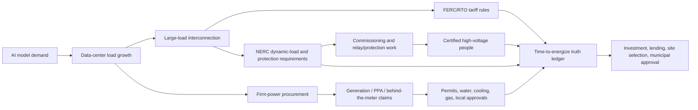

# Time-to-Energize Truth

Issued: 2026-06-19

## The One

Build the intelligence layer that tells capital whether an AI campus, HVDC line, co-located generation deal, or large-load interconnection can actually energize.

Not "AI needs power." That is consensus.

The thesis is narrower and stronger:

> The paid layer is source-grade time-to-energize truth: which announced MW claims survive official-source diligence, which are contested, and which are not decision-grade.

This is the one to concentrate on because it is true enough to act on now, early enough to be under-owned, and wide enough to become a company instead of a memo.

## Why This Is The Pick

The market has priced the obvious story: AI load is exploding, power is scarce, transformers are tight, and data-center developers need firm capacity. That headline is no longer the edge.

The underpriced layer is project truth. Public claims still compress many separate gates into one fake-simple word: "powered." A project is not power-secured unless the evidence verifies MW, counterparty or offtake, power path, tariff or interconnection treatment, permit/regulatory status, commissioning and protection requirements, high-voltage workforce dependency, water/cooling gate, and unresolved watch signals.

That is exactly where Vati already has an advantage: source verification, falsifiable claims, demotion/refutation, and buyer action.

## Proof Spine

| Evidence | What It Proves | Source |
|---|---|---|
| DOE/LBNL says U.S. data centers used about 4.4% of U.S. electricity in 2023 and could reach roughly 6.7% to 12% by 2028. | Demand pressure is real and near-term. | https://www.energy.gov/articles/doe-releases-new-report-evaluating-increase-electricity-demand-data-centers |
| FERC on 2026-06-18 ordered all six regional grid operators under its jurisdiction to justify or reform tariffs for data centers and other large users. | Large-load integration has moved into live federal market design. | https://www.ferc.gov/news-events/news/ferc-launches-aggressive-targeted-action-speed-large-load-integration |
| FERC RM26-4 frames large loads as generally over 20 MW and asks how to make interconnection timely, orderly, reliable, and fair. | The regulatory system is still deciding the rules for the exact buyer problem. | https://www.ferc.gov/rm26-4 |
| NERC's Level 3 alert names computational-load modeling, studies, instrumentation, commissioning, operations, protection, and control. Reporting is due 2026-08-03. | The bottleneck is not just MW. It is grid behavior, proof, commissioning, and reliability. | https://www.nerc.com/globalassets/programs/bpsa/alerts/level-3-computational-load-alert.pdf |
| ENTSO-E says Europe needs more than 100,000 km of new lines by 2030, 88% of TSOs face shortages, and more than half of 2030 transmission projects await permits. | This is not only a U.S. data-center story; it is a grid delivery story. | https://www.entsoe.eu/european-grids-package/ |
| National Grid says critical high-voltage roles take years to reach full competency or Senior Authorised Person status, and is piloting ways to halve SAP accreditation time to one year. | The "grid hands" bottleneck is real: qualified people are part of energization capacity. | https://www.nationalgrid.com/document/562961/download |

## The Forecast

By 2027-12-31, at least three public U.S. or EU AI-campus, HVDC, or large-load projects over 200 MW will have their claimed energization timeline pushed, conditioned, contested, or demoted in primary or official sources for reasons other than generic generation availability.

Qualifying reasons:

- interconnection tariff treatment
- dynamic-load modeling
- protection and control requirements
- commissioning evidence
- certified high-voltage workforce capacity
- unresolved permit, utility-service, water, or cooling status

Structural probability: 79%.

Exact clause probability: 52%.

Kill condition: large-load projects clear mostly through ordinary procurement and interconnection channels through 2027, with no repeated official-source evidence that these gates materially change energization timing. Also kill the business wedge if five qualified buyers with live assets say they already have better source-grade diligence and will not pay for outside verification.

## The Product

Start as a diligence sprint, become a data product.

The unit of value is not an essay. It is a row in a source-grade ledger:

| Field | Meaning |
|---|---|
| asset_id | The named campus, line, generation asset, or interconnection request. |
| market | PJM, ERCOT, MISO, SPP, CAISO, UK, EU market, etc. |
| claimed_mw | Publicly claimed MW and source. |
| verified_mw | MW supported by primary or official source. |
| counterparty | Tenant, utility, generator, offtaker, or unknown. |
| power_path | Grid service, co-location, behind-the-meter gas, nuclear PPA, hydro PPA, fuel cells, etc. |
| interconnection_status | RTO/ISO, utility, tariff, service-agreement, queue, or contested status. |
| reliability_gate | Dynamic model, ride-through, protection/control, NERC action, or none found. |
| commissioning_gate | Commissioning, relay/protection settings, SAP/HV workforce, EPC dependency. |
| permit_gate | Air, water, zoning, state siting board, utility commission, local approval. |
| source_tier | primary_verified, source_verified, contested, lead, not_decision_grade. |
| next_click | The exact docket, filing, permit, or counterparty question. |
| watch_signal | The next public signal that upgrades, demotes, or kills the claim. |
| buyer_action | Reserve, avoid, diligence, renegotiate, monitor, or kill. |

## The Web

This is strong because it is not isolated.

The thesis touches AI, power markets, federal rules, reliability engineering, labor, permitting, water, land, infrastructure finance, and public claims. That is why it can become a platform instead of a one-off note.

## 0 To 100 Roadmap

### 0-10: Commit To The Wedge

Do not sell "AI power scarcity." Sell verification of energization claims.

Name the product: Time-to-Energize Truth.

One sentence: "We verify whether AI infrastructure power claims survive primary-source diligence before capital believes the MW number."

### 10-20: Build The First 20-Row Ledger

Use the existing local AI campus dossier as the seed. Start with PJM, Ohio, Virginia, Louisiana, and one ERCOT comparison.

Required first rows:

- AWS / Talen Susquehanna
- Constellation / Microsoft Crane
- Google / Brookfield hydro framework
- Homer City
- AES Ohio / Amazon
- Dominion Culpeper Tech Zone
- Socrates North and South
- Apollo Power Generation
- Meta Richland Parish
- Crusoe / Lancium Abilene

Each row needs the source tier, unresolved gate, next click, and buyer action.

### 20-30: Create The Sample Buyer Artifact

Build a two-page sample:

- one verified row
- one contested row
- one not-decision-grade row
- one watchlist table
- one "question to ask the utility/EPC/sponsor"
- one stop rule

The sample must show a demotion. That proves the method is not just confirming hype.

### 30-40: Run Buyer Discovery Against Live Decisions

Only talk to buyers with one current decision:

- financing or debt sizing
- site acquisition
- power purchase or offtake
- interconnection strategy
- municipal approval
- tenant commitment
- project acquisition
- contractor contingency

The discovery question:

"Which live project could be worth less if the energization date is wrong?"

If they cannot name one, they are not the first customer.

### 40-50: Sell One Fixed-Scope Sprint

Do not productize yet. Close one fixed-scope diligence sprint around one buyer-provided asset list or docket set.

Deliverables:

- source ledger
- demotion/refutation table
- time-to-energize risk table
- action memo
- 30-day watchlist
- stop conditions

Do not lead with public pricing. The goal is to prove willingness to pay and decision value, not anchor the market too early.

### 50-60: Repeat Across Three Decision Types

Win three pilots in three categories:

- infra investor or lender
- data-center or land developer
- power developer or municipal/utility-adjacent buyer

The product is not real until it changes three different kinds of decisions.

### 60-70: Turn The Manual Ledger Into A Monitoring System

Add recurring ingestion and review from:

- FERC eLibrary and RM26-4 related orders
- PJM, MISO, SPP, ERCOT, CAISO, and utility planning materials
- OPSB, PUCO, SCC, LPSC, and local/state permit records
- NERC large-load actions and standards work
- company claims and press releases
- EPC and contractor award announcements
- workforce and accreditation sources

The system should alert when a row changes status, not just collect more documents.

### 70-80: Seal Forecasts And Score Outcomes

Every ledger row should spawn dated forecast cards:

- "This asset will not reach claimed energization by date X."
- "This project will get demoted from source_verified to contested by date Y."
- "This RTO tariff response will require Z evidence from large loads."

Score them. The public proof is not "we wrote a good memo." The proof is demotions, calls, and resolutions.

### 80-90: Productize The Feed

Once there are paying users and 50+ tracked assets, build:

- buyer dashboard
- API summary
- exportable watchlist
- source evidence packet
- asset status history
- calibration record
- CRM notes for design partners

The product promise becomes: "Before you underwrite a powered site, check the time-to-energize ledger."

### 90-100: Capitalize

Raise, partner, or scale only after these proof gates:

- three paying design partners
- 50+ assets tracked
- 10+ public claim demotions
- at least one resolved forecast card
- one buyer quote saying the work changed a real decision
- repeatable source workflow under one day per new asset

The maximum capitalization version is a rating layer for AI infrastructure power truth: not a consultancy, not a newsletter, not a commodity dashboard. A scored evidence system for the most bottlenecked buildout in the world.

## Next 72 Hours

1. Freeze this as the one active wedge.
2. Build the 20-row source ledger from the existing AI campus dossier.
3. Create the two-page sample with one verified, one contested, and one not-decision-grade row.
4. Write 15 manual buyer notes, each tied to a specific live asset or decision.
5. Ask only one discovery question: "What project are you currently underwriting where a false energization date would cost money?"
6. Stop if no buyer can name a live decision after 20 serious conversations.

## What Not To Do

- Do not make another broad Pope board before this has buyer contact.
- Do not pitch "AI power scarcity."
- Do not sell a dashboard before one manual sprint has changed a decision.
- Do not make stock picks from it.
- Do not call a project power-secured from company copy alone.
- Do not soften the demotions. The demotion is the product.
